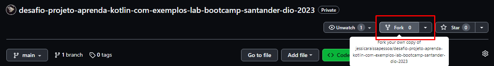
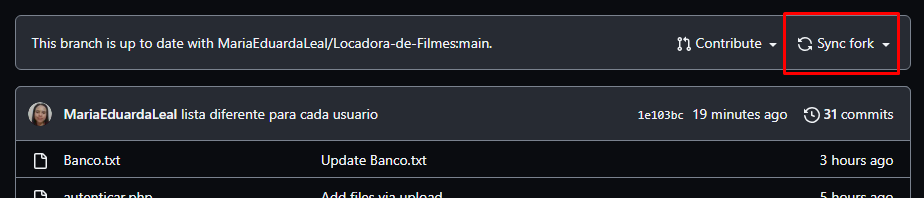
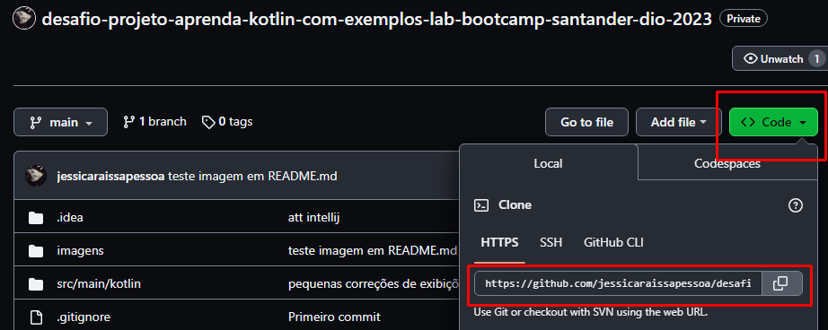

# Desafio de Projeto: Lab Aprenda Kotlin com Exemplos - Bootcamp Santander/DIO - 2023

 
Repositório destinado à minha abstração para o desafio de projeto "Abstraindo Formações da DIO Usando Orientação a Objetos com Kotlin", do bootcamp Santander 2023, na trilha "Mobile Android com Kotlin"

----------

## Tecnologias utilizadas
###
* **Linguagem:** Kotlin
* **Versionamento:** Git/GitHub
* **IDE:** Intellij IDEA Ultimate

----------

## O projeto
###
* Trata-se de uma aplicação para a simulação de um sistema da DIO. 
* O sistema construído apresenta usuários, formações, conteúdos educacionais, tipos de usuário, tipos de conteúdo educacional e níveis de dificuldade (aplicáveis a formações e conteúdos educacionais)
* Formações podem conter conteúdos educacionais e usuários cadastrados

----------

## Como usar este repositório
###
* Nessa tela inicial do repositório, faça um fork clicando na opção, conforme mostra a imagem a seguir. Isso criará uma cópia (clone) desse repositório em seus repositórios no GitHub
  
* Preencha o formulário "Create a new fork" para customizar clone será criado em seu GitHub
* No repositório, acima dos arquivos, sempre haverá aviso caso tenha sido feitas alterações no repositório original. Com "Sync fork" você puxa essas alterações para seu repositório, mantendo-o atualizado
  
* Para criar uma cópia local desse repositório clonado, selecione/crie a pasta para ele no computador
* No seu repositório clonado, clique em Code e copie o link na aba HTTPS
  
* Nessa pasta, inicialize o Git Bash
* Comando `git clone linkDoSeuRepositorioClonado`
* Comando `git remote add upstream https://github.com/jessicaraissapessoa/desafio-projeto-aprenda-kotlin-com-exemplos-lab-bootcamp-santander-dio-2023.git`
* Comando `git remote -v`
* Agora há conexão com os repositórios clone e original
* Agora divirta-se com a aplicação na IDE de sua preferência

----------

## Organização
###

Em [src/main/kotlin](https://github.com/jessicaraissapessoa/desafio-projeto-aprenda-kotlin-com-exemplos-lab-bootcamp-santander-dio-2023/tree/main/src/main/kotlin) estão os códigos da aplicação.
Esses códigos estão divididos em packages (pastas/diretórios). Segue a descrição do que engloba cada package:

| Package                                                                                                                                                                                                 | Descrição                                                                                                                                                                | Arquivos                                                                                                                                                                                                                                                                                                                                                                                                                                                                                                                                                                                                                                                                                                                                                                                                                                                                                                                                                                                                                                                                                                                                                                                                                                                                                                                                                                                                                                                          |
|---------------------------------------------------------------------------------------------------------------------------------------------------------------------------------------------------------|--------------------------------------------------------------------------------------------------------------------------------------------------------------------------|-------------------------------------------------------------------------------------------------------------------------------------------------------------------------------------------------------------------------------------------------------------------------------------------------------------------------------------------------------------------------------------------------------------------------------------------------------------------------------------------------------------------------------------------------------------------------------------------------------------------------------------------------------------------------------------------------------------------------------------------------------------------------------------------------------------------------------------------------------------------------------------------------------------------------------------------------------------------------------------------------------------------------------------------------------------------------------------------------------------------------------------------------------------------------------------------------------------------------------------------------------------------------------------------------------------------------------------------------------------------------------------------------------------------------------------------------------------------|
| [src/main/kotlin/aplicacao](https://github.com/jessicaraissapessoa/desafio-projeto-aprenda-kotlin-com-exemplos-lab-bootcamp-santander-dio-2023/tree/main/src/main/kotlin/aplicacao)                     | Pasta contém a main (inicializadora da aplicação) e as simulações de interfaces (menus para navegação do usuário que conectam e ordenam todas as execuções da aplicação) | [Main.kt](https://github.com/jessicaraissapessoa/desafio-projeto-aprenda-kotlin-com-exemplos-lab-bootcamp-santander-dio-2023/blob/main/src/main/kotlin/aplicacao/Main.kt) [telaInicial.kt](https://github.com/jessicaraissapessoa/desafio-projeto-aprenda-kotlin-com-exemplos-lab-bootcamp-santander-dio-2023/blob/main/src/main/kotlin/aplicacao/telaInicial.kt) [menuUsuario.kt](https://github.com/jessicaraissapessoa/desafio-projeto-aprenda-kotlin-com-exemplos-lab-bootcamp-santander-dio-2023/blob/main/src/main/kotlin/aplicacao/menuUsuario.kt) [menuConteudoEducacional.kt](https://github.com/jessicaraissapessoa/desafio-projeto-aprenda-kotlin-com-exemplos-lab-bootcamp-santander-dio-2023/blob/main/src/main/kotlin/aplicacao/menuConteudoEducacional.kt) [menuFormacao.kt](https://github.com/jessicaraissapessoa/desafio-projeto-aprenda-kotlin-com-exemplos-lab-bootcamp-santander-dio-2023/blob/main/src/main/kotlin/aplicacao/menuFormacao.kt)                                                                                                                                                                                                                                                                                                                                                                                                                                                                               |
| [src/main/kotlin/enums](https://github.com/jessicaraissapessoa/desafio-projeto-aprenda-kotlin-com-exemplos-lab-bootcamp-santander-dio-2023/tree/main/src/main/kotlin/enums)                             | Pasta contém todos os enums da aplicação. Tipo de dado que armazena conjuntos de valores fixos                                                                           | [TipoUsuario.kt](https://github.com/jessicaraissapessoa/desafio-projeto-aprenda-kotlin-com-exemplos-lab-bootcamp-santander-dio-2023/blob/main/src/main/kotlin/enums/TipoUsuario.kt) [TipoConteudoEducacional.kt](https://github.com/jessicaraissapessoa/desafio-projeto-aprenda-kotlin-com-exemplos-lab-bootcamp-santander-dio-2023/blob/main/src/main/kotlin/enums/TipoConteudoEducacional.kt) [NivelDificuldade.kt](https://github.com/jessicaraissapessoa/desafio-projeto-aprenda-kotlin-com-exemplos-lab-bootcamp-santander-dio-2023/blob/main/src/main/kotlin/enums/NivelDificuldade.kt)                                                                                                                                                                                                                                                                                                                                                                                                                                                                                                                                                                                                                                                                                                                                                                                                                                                             |
| [src/main/kotlin/usuario](https://github.com/jessicaraissapessoa/desafio-projeto-aprenda-kotlin-com-exemplos-lab-bootcamp-santander-dio-2023/tree/main/src/main/kotlin/usuario)                         | Pasta contém classe e funções relativas ao usuário. Adição, edição e remoção de usuários no sistema                                                                      | [Usuario.kt](https://github.com/jessicaraissapessoa/desafio-projeto-aprenda-kotlin-com-exemplos-lab-bootcamp-santander-dio-2023/blob/main/src/main/kotlin/usuario/Usuario.kt) [listaUsuarios.kt](https://github.com/jessicaraissapessoa/desafio-projeto-aprenda-kotlin-com-exemplos-lab-bootcamp-santander-dio-2023/blob/main/src/main/kotlin/usuario/listaUsuarios.kt) [exibicoesUsuario.kt](https://github.com/jessicaraissapessoa/desafio-projeto-aprenda-kotlin-com-exemplos-lab-bootcamp-santander-dio-2023/blob/main/src/main/kotlin/usuario/exibicoesUsuario.kt) [cadastroUsuario.kt](https://github.com/jessicaraissapessoa/desafio-projeto-aprenda-kotlin-com-exemplos-lab-bootcamp-santander-dio-2023/blob/main/src/main/kotlin/usuario/cadastroUsuario.kt) [edicaoUsuario.kt](https://github.com/jessicaraissapessoa/desafio-projeto-aprenda-kotlin-com-exemplos-lab-bootcamp-santander-dio-2023/blob/main/src/main/kotlin/usuario/edicaoUsuario.kt) [remocaoUsuario.kt](https://github.com/jessicaraissapessoa/desafio-projeto-aprenda-kotlin-com-exemplos-lab-bootcamp-santander-dio-2023/blob/main/src/main/kotlin/usuario/remocaoUsuario.kt)                                                                                                                                                                                                                                                                                   |
| [src/main/kotlin/conteudoEducacional](https://github.com/jessicaraissapessoa/desafio-projeto-aprenda-kotlin-com-exemplos-lab-bootcamp-santander-dio-2023/tree/main/src/main/kotlin/conteudoEducacional) | Pasta contém classe e funções relativas ao conteúdo educacional. Adição, edição e remoção de conteúdos educacionais no sistema                                           | [ConteudoEducacional.kt](https://github.com/jessicaraissapessoa/desafio-projeto-aprenda-kotlin-com-exemplos-lab-bootcamp-santander-dio-2023/blob/main/src/main/kotlin/conteudoEducacional/ConteudoEducacional.kt) [listaConteudosEducacionais.kt](https://github.com/jessicaraissapessoa/desafio-projeto-aprenda-kotlin-com-exemplos-lab-bootcamp-santander-dio-2023/blob/main/src/main/kotlin/conteudoEducacional/listaConteudosEducacionais.kt) [exibicoesConteudoEducacional.kt]() [cadastroConteudoEducacional.kt](https://github.com/jessicaraissapessoa/desafio-projeto-aprenda-kotlin-com-exemplos-lab-bootcamp-santander-dio-2023/blob/main/src/main/kotlin/conteudoEducacional/cadastroConteudoEducacional.kt) [edicaoConteudoEducacional.kt](https://github.com/jessicaraissapessoa/desafio-projeto-aprenda-kotlin-com-exemplos-lab-bootcamp-santander-dio-2023/blob/main/src/main/kotlin/conteudoEducacional/edicaoConteudoEducacional.kt) [remocaoConteudoEducacional.kt](https://github.com/jessicaraissapessoa/desafio-projeto-aprenda-kotlin-com-exemplos-lab-bootcamp-santander-dio-2023/blob/main/src/main/kotlin/conteudoEducacional/remocaoConteudoEducacional.kt)                                                                                                                                                                                                                                                         |
| [src/main/kotlin/formacao](https://github.com/jessicaraissapessoa/desafio-projeto-aprenda-kotlin-com-exemplos-lab-bootcamp-santander-dio-2023/tree/main/src/main/kotlin/formacao)                       | Pasta contém classe e funções relativas à formação educacional. Adição, edição e remoção de formações, de usuários em formações e de conteúdos educacionais em formações | [Formacao.kt](https://github.com/jessicaraissapessoa/desafio-projeto-aprenda-kotlin-com-exemplos-lab-bootcamp-santander-dio-2023/blob/main/src/main/kotlin/formacao/Formacao.kt) [listaFormacoes.kt](https://github.com/jessicaraissapessoa/desafio-projeto-aprenda-kotlin-com-exemplos-lab-bootcamp-santander-dio-2023/blob/main/src/main/kotlin/formacao/listaFormacoes.kt) [exibicoesFormacao.kt](https://github.com/jessicaraissapessoa/desafio-projeto-aprenda-kotlin-com-exemplos-lab-bootcamp-santander-dio-2023/blob/main/src/main/kotlin/formacao/exibicoesFormacao.kt) [cadastroFormacao.kt](https://github.com/jessicaraissapessoa/desafio-projeto-aprenda-kotlin-com-exemplos-lab-bootcamp-santander-dio-2023/blob/main/src/main/kotlin/formacao/cadastroFormacao.kt) [edicaoFormacao.kt](https://github.com/jessicaraissapessoa/desafio-projeto-aprenda-kotlin-com-exemplos-lab-bootcamp-santander-dio-2023/blob/main/src/main/kotlin/formacao/edicaoFormacao.kt) [remocaoFormacao.kt]() [edicaoUsuarioEmFormacao.kt](https://github.com/jessicaraissapessoa/desafio-projeto-aprenda-kotlin-com-exemplos-lab-bootcamp-santander-dio-2023/blob/main/src/main/kotlin/formacao/edicaoUsuarioEmFormacao.kt) [edicaoConteudoEmFormacao.kt](https://github.com/jessicaraissapessoa/desafio-projeto-aprenda-kotlin-com-exemplos-lab-bootcamp-santander-dio-2023/blob/main/src/main/kotlin/formacao/edicaoConteudoEmFormacao.kt) |

----------

## Detalhamento do sistema
###

  

