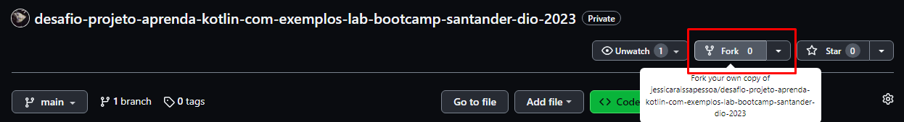

# Desafio de Projeto: Lab Aprenda Kotlin com Exemplos - Bootcamp Santander/DIO - 2023

Repositório destinado à minha abstração para o desafio de projeto "Abstraindo Formações da DIO Usando Orientação a Objetos com Kotlin", do bootcamp Santander 2023, na trilha "Mobile Android com Kotlin"

## O projeto

Trata-se de uma aplicação para a simulação de um sistema da DIO. O sistema construído apresenta usuários, formações, conteúdos educacionais, tipos de usúario e tipos de conteúdo educacional e níveis de dificuldade (aplicáveis à formações e conteúdos educacionais).

## Como usar este repositório

* Nessa tela inicial do repositório, faça um fork clicando na opção, conforme mostra a imagem a seguir. Isso criará uma cópia desse repositório em seus repositórios no GitHub
  
* 

### Sistema

Segue o esquema dos arquivos (com suas classes e métodos):

- [src/main/kotlin/Usuario.kt](https://github.com/jessicaraissapessoa/desafio-projeto-aprenda-kotlin-com-exemplos-lab-bootcamp-santander-dio-2023/blob/main/src/main/kotlin/Usuario.kt): Relativa ao usuário

| Elemento | Componentes | Descrição |
| - | - | - |
| Data class Usuario | var idUsuario, var nomeUsuario, var tipoUsuario, contrutor vazio, toString() | Classe relativa à estrutura de construção do usuário e de sua exibição |
| var listaUsuarios | MutableList<Usuario> | lista iterável composta de Usuario |
| exibirUsuarios() | val builder = StringBuilder() | Função para exibição de listaUsuario. A exibição de cada Usuario (toString) é iterada em uma String única de listaUsuarios por meio do StringBuilder |
| cadastrarUsuario() | val id, val tecladoNomeUsuario, val selecaoTipoUsuario | Função para cadastrar novo Usuario, inserindo-os na lista de usuários (listaUsuarios) por meio da passagem respectiva dos valores das variáveis descritas para as variáveis do Usuario. Cada etapa do cadastro possui validações (para não receber nulo ou vazio, para não receber número no nome etc.) |
| excluirUsuario() | val opcoes, var selecaoRemocaoUsuario, val usuarioRemovido |  

 
  - 
  - cadastrarUsuario()
  - excluirUsuario()
  - 
  

